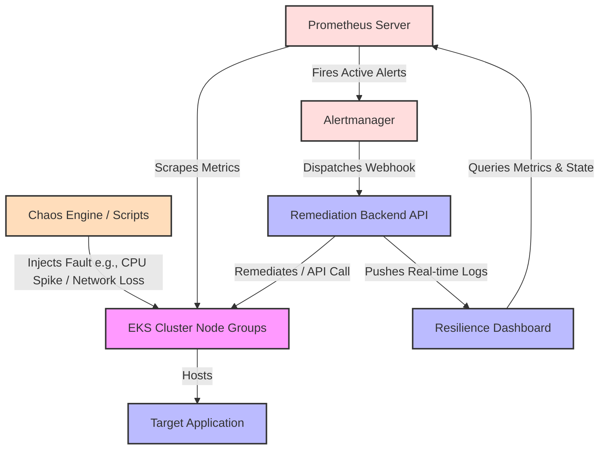

# 🛠️ Self-Healing Cloud Infrastructure Project

[](https://opensource.org/licenses/MIT)
[](https://www.terraform.io/)
[](https://kubernetes.io/)
[](https://prometheus.io/)
[](https://grafana.com/)
[](https://react.dev/)

A production-grade, self-healing Kubernetes infrastructure monorepo designed to autonomously detect, isolate, and recover from real-world infrastructure failures. By combining infrastructure-as-code, real-time observability, auto-remediation loops, and chaos engineering, this project demonstrates how to build resilient systems that maintain high availability with zero human intervention.

---

## 🏗️ System Architecture

This project implements a closed-loop remediation architecture. When a failure is introduced (manually or via chaos scenarios), Prometheus detects the anomaly, triggers an alert manager route to the backend remediation service, and the system executes a target recovery playbook (e.g., node rotation, pod replication adjustment, or network route resetting) while presenting live status on the React dashboard.



*An interactive system diagram is also saved in `docs/architecture.png` (coming soon).*

---

## 🧰 Tech Stack

- **Infrastructure & Provisioning**: Terraform, AWS (VPC, IAM, EKS / Elastic Kubernetes Service)
- **Container Orchestration**: Kubernetes (k8s), Helm (for package management)
- **Monitoring & Observability**: Prometheus (metrics ingestion & alerting), Grafana (visualization dashboards)
- **Remediation & API Services**:
  - **Backend**: Node.js/TypeScript (handles webhooks, Kubernetes client API orchestration, and remediation logic)
  - **Frontend**: React, TailwindCSS, Vite (visual dashboard representing active faults, node health, and remediation histories)
- **Chaos Engineering**: Bash / kubectl scenarios (CPU spikes, memory exhaustion, pod eviction, network latency injection)
- **CI/CD Pipeline**: GitHub Actions (automated terraform linting, security scans, docker builds, and deployment verification)

---

## 📂 Repository Structure

```tree
repo-root/
├── app/
│   ├── frontend/          # React-based Resilience Dashboard
│   └── backend/           # Node.js Remediation API & Automation Service
│
├── terraform/
│   ├── networking/        # VPC, subnets, NAT Gateways, Security Groups
│   ├── compute/           # AWS EKS cluster, managed node groups, and autoscaling configs
│   └── iam/               # IAM roles, policies, and service accounts
│
├── kubernetes/
│   ├── manifests/         # Deployment, Service, Ingress, HPA, and ConfigMaps YAML
│   └── helm/              # Custom helm charts for Prometheus/Grafana stack overrides
│
├── .github/
│   └── workflows/         # CI/CD pipelines (lint, test, build, scan, deploy)
│
├── monitoring/
│   ├── prometheus/        # Alerting rules, alertmanager routing config, and scrape targets
│   └── grafana/           # JSON files for custom cluster and remediation dashboards
│
├── chaos/
│   └── scenarios/         # Fault injection scripts (pod kills, CPU spikes, network disruptions)
│
├── docs/
│   ├── architecture.png   # Architecture diagram image
│   └── demo-notes.md      # Companion notes for the project demo
│
└── README.md              # Project overview, tech stack, and setup guide
```

---

## 🚀 How to Deploy It Yourself

### Prerequisites
- [Terraform](https://developer.hashicorp.com/terraform/downloads) (>= 1.5.0)
- [AWS CLI](https://aws.amazon.com/cli/) configured with Admin access
- [kubectl](https://kubernetes.io/docs/tasks/tools/)
- [Node.js](https://nodejs.org/) (>= 18.0.0)

### 1. Provision Infrastructure
Initialize and apply the Terraform configuration to provision your VPC and EKS cluster:
```bash
cd terraform/networking
terraform init && terraform apply -auto-approve

cd ../compute
terraform init && terraform apply -auto-approve
```

### 2. Configure Kubectl Context
Update your local kubeconfig to point to your new EKS cluster:
```bash
aws eks update-kubeconfig --region <your-aws-region> --name <eks-cluster-name>
```

### 3. Deploy Observability Stack & Remediation Engine
Deploy the Prometheus alert configs and the auto-healing backend service:
```bash
# Deploy target apps and monitoring stack
kubectl apply -f kubernetes/manifests/

# Start the remediation backend service
cd app/backend
npm install && npm run start
```

### 4. Run the Resilience Dashboard
```bash
cd app/frontend
npm install && npm run dev
```

---

## ⚡ Chaos Engineering & Self-Healing Demo

This project demonstrates resiliency under failure. You can trigger simulated outages in the `chaos/scenarios/` directory:

### Available Scenarios:
1. **Pod Eviction (`pod_kill.sh`)**: Evicts application instances under load to demonstrate how Kubernetes ReplicaSets ensure zero downtime.
2. **CPU Exhaustion (`cpu_spike.sh`)**: Drives CPU utilization to 100% on a node, triggering Kubernetes Horizontal Pod Autoscaling (HPA) and cluster node auto-scaling.
3. **Network Disruption (`network_loss.sh`)**: Injects network latency and packet loss to trigger failovers and health probe remediations.

### Remediation Walkthrough:
1. Run `bash chaos/scenarios/cpu_spike.sh`.
2. Observe metrics spiking on the Grafana dashboard.
3. Prometheus detects the condition, triggering an alert with `severity: critical`.
4. Alertmanager dispatches a webhook to the backend remediation service.
5. The backend initiates a drain operation on the affected node and spins up a healthy replacement node using EKS Auto Scaling Groups.
6. The dashboard displays the real-time recovery status showing that traffic remained uninterrupted.

---

## 📺 Demo & Live Dashboard

- **Demo Video Walkthrough**: [Link to YouTube/Vimeo Demo Video](https://your-demo-link.com)
- **Live Dashboard**: [Link to Active Live Infrastructure Dashboard](https://your-dashboard-link.com)
